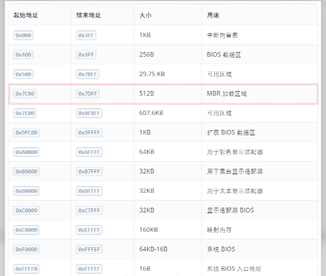
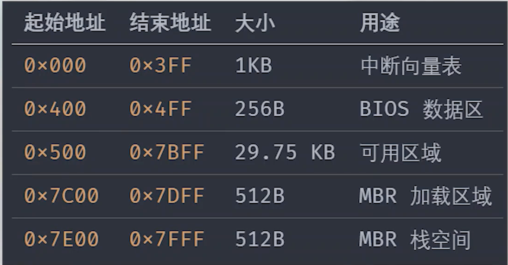

# 03 7C00 问题

|本期版本|上期版本
|:---:|:---:
`Mon Apr 21 13:15:27 CST 2025` | `Fri Mar 22 12:24:44 CST 2024`

* `IBM PC 5150`
* 最小的要求内存时 16KB
* DOS 1.0 至少需要32KB

**原因**

* 引导扇区有 512 字节
* 引导程序使用的栈还需要512字节

> 引导程序总共需要 512 + 512 = 1KB

* 把这1KB的空间，放到32KB的最后，似乎是一个比较合理的选择

**后面的区域**

* 1987年 vga ，由IBM标准化