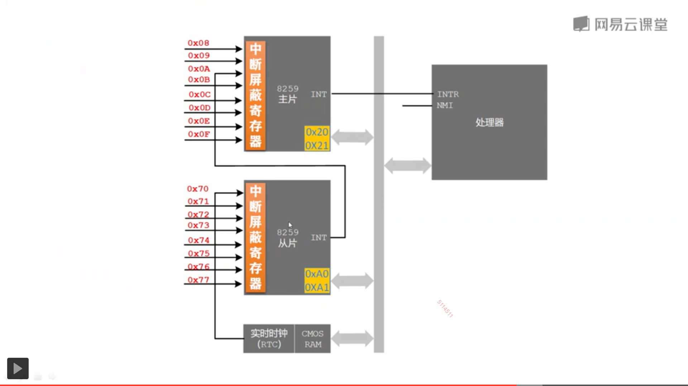

# 14 外中断和时钟

|本期版本|上期版本
|:---:|:---:
`Tue Mar 26 10:16:43 CST 2024` |

---

> [131 启用更新周期结束中断](https://study.163.com/course/courseLearn.htm?courseId=1209670804#/learn/video?lessonId=1280833423&courseId=1209670804)




## 中断向量表

向量 | 功能
---|---
8 | 时钟

## 8259


端口 | 说明 | 标记
---|---|---
0x20 | 主 PIC 命令端口 | PIC\_M\_CMD
0x21 | 主 PIC 数据端口 | PIC\_M\_DATA
0xA0 | 从 PIC 命令端口 | PIC\_S\_CMD
0xA1 | 从 PIC 数据端口 | PIC\_S\_DATA

**寄存器(7个寄存器)**

> 配置完成之后， 21/A1收到的数据就是OCW1, 20/A0 则仍然通过 三四两个转台位来判断是对应写到哪个寄存器

* ICW1 ~ ICW4 用于初始化 8259 initialization Command Words
* OCW1 ~ OCW3 用于操作 Operation Command Words


寄存器|端口|备注
---|---|---
`OCW1` | 写入主片的 `0x21` 或从片的 `0xA1` 端口 | 用来屏蔽连接在 8259A 上的外部设备的中断信号
`OCW2` | 写入主片的 `0x20` 及从片的 `0xA0` 端口 | 用来设置中断结束方式和优先级模式

**流程**


* 向 `OCW1` 写入屏蔽字，打开时钟中断
* `sti` 设置 cpu 允许外中断
*  向 `OCW2` 写入 `0x20` ，表示中断处理完毕

```
mov al, 0b1111_1110
out PIC_M_DATA, al

mov al, 0x20
out PIC_M_CMD, al
```

## Ref

* <https://wiki.osdev.org/8259_PIC>
* <https://pdos.csail.mit.edu/6.828/2005/readings/hardware/8259A.pdf>
* [操作系统真象还原 学习笔记08--中断](https://www.kn0sky.com/?p=47)
* [汇编学习笔记(25) - 8259中断芯片 - 蹦蹦骑士 - 博客园](https://www.cnblogs.com/alwaysking/p/14530023.html)
