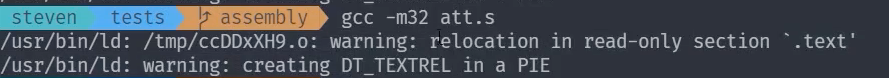

# 25  C 变量和函数参数

|本期版本|上期版本
|:---:|:---:
`Tue Apr 23 10:27:19 CST 2024` | `Mon Apr  1 17:57:10 CST 2024`

## 问题



```
gcc -m32 att.s
```

- as 编译的问题
- text 段重定位的警告

```
as -32 att.s -o att.o
gcc -m32 att.o

# 可从定位文件是临时的
gcc -m32 att.s

gcc -m32 att.s -no-pie
```

## 全局变量


```
CFLAGS:= -m32 \
				 -fno-asynchronous-unwind-tables \
				 -fno-pic \
				 -mpreferred-stack-boundary=2 \
				 -O0

```

显现一个段的具体内容

```
readelf -x .data variable.o
```


## 局部变量

* 生命周期 - 两个大括号之间
* 局部变量存储在栈中


> 在任何文件中都可以打断点

* `break`

## 栈保护

* 随机数对比
* `-fno-stack-protector`


```s
# 获取有效地址
leal -5(%ebp), %eax
```

## 参数传递

